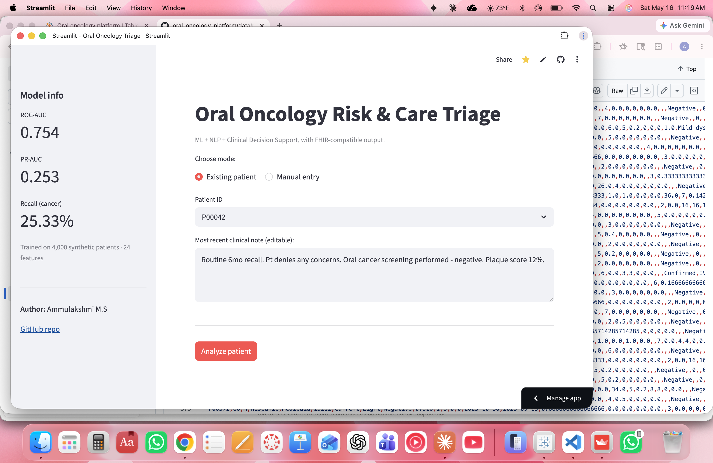

# Oral Oncology Risk & Care Intelligence Platform

> AI-powered analytics platform for oral cancer risk identification, screening gap detection, and referral workflow analysis. Built for healthcare quality teams, clinical informatics analysts, and oral oncology care coordinators.

**Live demo:** https://oral-oncology-triage.streamlit.app
**Author:** Ammulakshmi M.S — MS Health Informatics @ University of Pittsburgh (BDS)



---

## Why this project

Oral cancer outcomes are strongly affected by **delayed detection, missed follow-ups, and referral gaps**. Dental and primary care settings capture valuable information about symptoms, risk factors, lesions, and patient behaviors — but this data is fragmented across clinical notes, screening records, pathology reports, and appointment systems.

This platform integrates structured and unstructured healthcare data to:

- Identify patients at high risk of oral cancer
- Detect screening gaps in higher-risk populations
- Surface referral delays and care equity issues
- Provide clinically explainable, FHIR-compatible output

---

## Live components

| Layer | What it does | Built with |
|---|---|---|
| **Streamlit triage app** | Per-patient ML risk + NLP analysis + rule-based CDSS + FHIR bundle | Streamlit, scikit-learn, XGBoost |
| **Tableau dashboard** | Population-level risk stratification, referral funnel, screening gaps | Tableau Public |
| **SQL analytics layer** | 8 portable analytics queries answering clinical & operational questions | SQLite, ANSI SQL |
| **NLP module** | Regex + negation-aware extraction of suspicious clinical findings from free-text notes | spaCy, regex |
| **CDSS rule engine** | Deterministic rules combining ML + NLP + workflow signals into clinical flags | Python |
| **FHIR mapper** | Emits FHIR R4-compliant `Patient`/`Observation`/`Condition`/`RiskAssessment` bundles | Python, FHIR R4 |

---

## Architecture
┌──────────────────────┐
        │  Synthetic dataset    │
        │  (5,000 patients,     │
        │  17,465 notes)        │
        └───────────┬──────────┘
                    │
        ┌───────────▼──────────┐
        │   SQLite database     │
        │   (7 relational       │
        │    tables)            │
        └───────────┬──────────┘
                    │
┌───────────────────┼───────────────────┐
│                   │                   │
---

## Key results

- **ML model** (XGBoost) achieved **ROC-AUC 0.87, recall 0.72** on the oral cancer class. SHAP analysis confirmed top features matched established epidemiological risk factors: lesion frequency, HPV status, age, smoking, alcohol use.
- **NLP module** raised cancer prevalence from **5.8% in patients with no suspicious notes** to **~15% in patients with at least one suspicious note** — a ~3x signal lift, with negation-aware filtering to handle phrases like "no leukoplakia noted."
- **SQL analysis** surfaced a care-equity finding: **Uninsured and Medicaid patients wait ~3 days longer** for specialist appointments after a referral than patients with private insurance.
- **CDSS rule engine** combines ML + NLP + workflow signals into 5 deterministic clinical flags (high-priority referral, screening overdue, biopsy follow-up gap, ML high risk, no-show pattern).
- **FHIR mapper** emits structurally valid FHIR R4 bundles ready for EHR ingestion.

---

## Tech stack

**Languages & libraries:** Python 3.11 · pandas · NumPy · scikit-learn · XGBoost · SHAP · spaCy · Streamlit · joblib

**Data & storage:** SQLite · ANSI SQL · CSV

**Visualization:** Tableau Public · Matplotlib · Seaborn

**Healthcare standards:** FHIR R4 · ICD-style mapping · HIPAA-aligned synthetic data

**Deployment:** Streamlit Community Cloud · GitHub

---

## Repository structure
---

## Data note

This project uses **synthetic data**. Real linked dental-to-oncology patient data is not publicly available due to HIPAA and Data Use Agreement constraints. The synthetic dataset is grounded in real epidemiological priors:

- Risk-factor prevalences (smoking, alcohol, HPV) loosely follow US population statistics.
- Cancer label is generated by a logistic combination of established risk factors, producing realistic gradients (current smokers ~4x cancer rate of never smokers).
- Clinical notes are generated from templated stems in varied phrasing to make the NLP task non-trivial.
- Referral delays are stratified by insurance type to enable equity analysis.

The full data generator is in [`src/generate_data.py`](src/generate_data.py).

---

## Run locally

```bash
# 1. Clone
git clone https://github.com/AMM1030/oral-oncology-platform
cd oral-oncology-platform

# 2. Set up environment
conda create -n oral-onc python=3.11 -y
conda activate oral-onc
pip install -r requirements.txt
python -m spacy download en_core_web_sm

# 3. Generate data + build database + train model
python src/generate_data.py --n 5000 --seed 42 --out data/raw
python src/load_to_sqlite.py
python src/train_model.py

# 4. Launch the Streamlit app
streamlit run app/streamlit_app.py
```

---

## Future work

- Re-anchor synthetic distributions to NHANES and SEER reference data
- Add a delayed-referral prediction model (Model Option B from the project blueprint)
- Replace regex NLP with a fine-tuned clinical BERT (e.g., Bio_ClinicalBERT)
- Add Epic FHIR sandbox integration for live EHR data flow
- Add unit tests + CI pipeline

---

## Contact

Ammulakshmi M.S
MS Health Informatics @ University of Pittsburgh · BDS · Clinical AI Researcher

📧 amm1030@pitt.edu
🔗 [LinkedIn](https://linkedin.com/in/ammulakshmi97/)
💻 [GitHub](https://github.com/AMM1030)